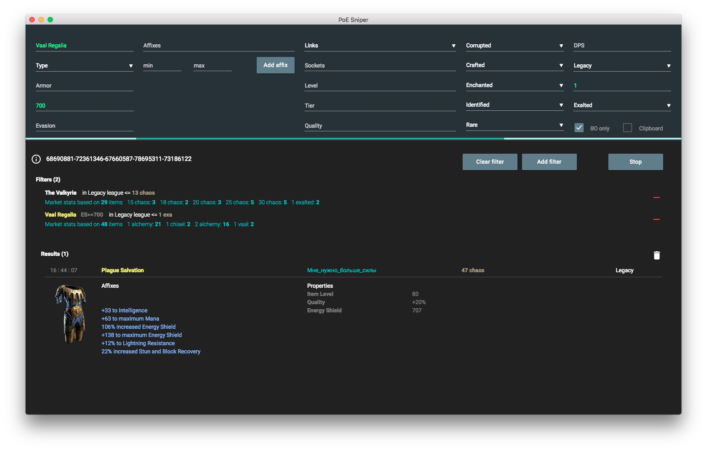

### Releases
You can grab the latest release [here](https://github.com/licoffe/POE-sniper/releases).

__Note for Linux users__: Make sure to install the [_xclip_](https://linux.die.net/man/1/xclip) clipboard manager to be able to copy whisper messages to the clipboard.

### Introduction
This tool lets you run live searches by parsing the latest item data from the Path of Exile API. The main benefit of this tool compared to poe.trade live search is the ability to centralize and save searches within a single window.

### Video
[Here](https://youtu.be/-R8lXIVEd-k) is a short 5 min video showcasing some of the features of the tool :)

### Features
Here is the set of features currently supported:

- Find underpriced items for each leagues
- Create item filters based on various criteria:
    - type
    - Armor/Shield/Evasion values
    - Affixes
    - Number of links
    - Sockets (total and R/G/B/W)
    - Item level
    - Item tier
    - Gem XP%
    - Quality
    - Corrupted/crafted/enchanted/identified
    - Rarity (including non-unique)
    - DPS (Total, Phys)
    - League
    - Price
- Import your poe.trade searches
- Show price stats of similar items appearing on poe.trade
- Search on poe.trade using your filter criteria
- Links to poe.trade, poe-rates.com search as well as the official wiki
- Notification support (both visual and sound)
- Contact sellers by clicking on an item entry or toggle automatic copy to the clipboard.
- Item price recommendation based on poe.trade

### Technologies
The app is written in [Node.js](https://nodejs.org/en/) and packaged as a native application using the [Electron](https://electron.atom.io/) framework.

### How it works 
The tool starts by fetching the last change_id using the [http://poe-rates.com](poe-rates) API. Chunks are then downloaded from the Path of Exile API with gzip compression into memory. Each item in the chunk is compared to the filters created by the user and, should it match the criteria, displayed in the tool.

### How fast is it?
It depends on your connection speed.

### Is it faster than poe.trade?
It is [slightly faster](https://www.youtube.com/watch?v=LvW7x6OCEJU) for me, but that may not be the case for everyone.

### Running the tool
There are two ways to run the tool, either from the sources directly or by fetching one of the releases.
#### From source
Within a terminal:
- Clone the code using `git clone https://github.com/licoffe/POE-sniper.git`
- Change to the cloned location and run `npm install` to install all dependencies
- Finally, run `npm start` to start the indexer

### Disclaimer
Make sure to have an unlimited connection plan and a good bandwidth since the tool downloads currently around 1.5 MB of JSON data every second.